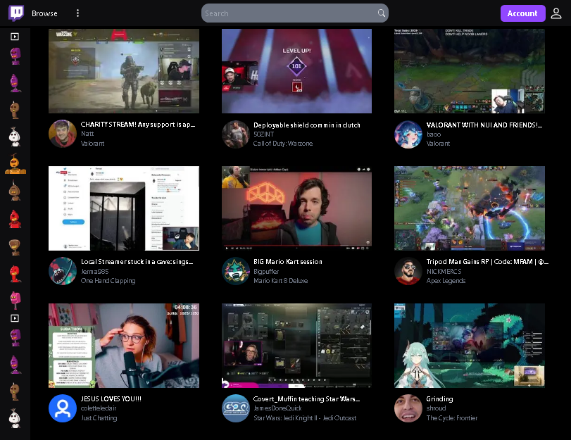

<h1 align="center"> Twitch app in Next + tailwind </h1>



# :hammer: Project description

<h2> 
I recreate Twitch in Next.JS styled with Tailwind CSS and as a bonus we will even add NextAuth.js for authentication using Github & Google! <br>im using some mock data from <a>https://mockaroo.com </a> and utilizing Headless UI!
</h2>

🏆 Build Twitch UI with Next.JS <br>
🏆 NextAuth.js web app authentication<br>
🏆 Headless UI Component<br>
🏆 Create a fully responsive web app in Next.JS styled with Tailwind CSS<br>
🏆 Lazy loading images with the Image component<br>
🏆 Statically imported images & external URL loaded images<br>
🏆 Routing in Next.js<br>

# :wrench: Languages, dependencies and libs used!

- `React`
- `NextJS`
- `TailwindCSS`
- `Next-AUTH`
- `Headless UI`


## Getting Started

First install, after install run the development server:

npm i

```bash
npm run dev
# or
yarn dev
```

